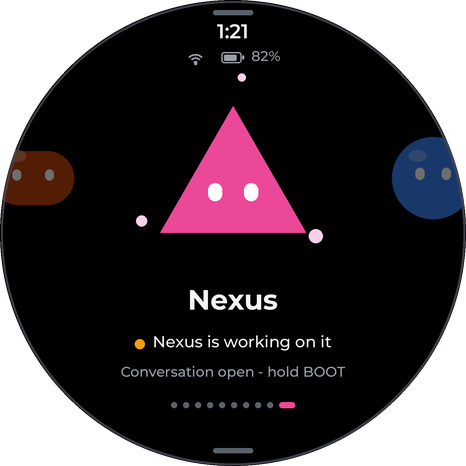
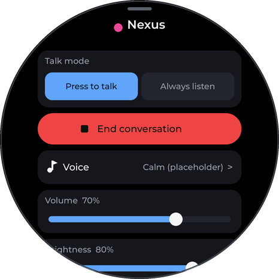
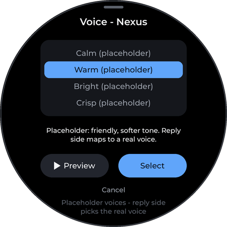
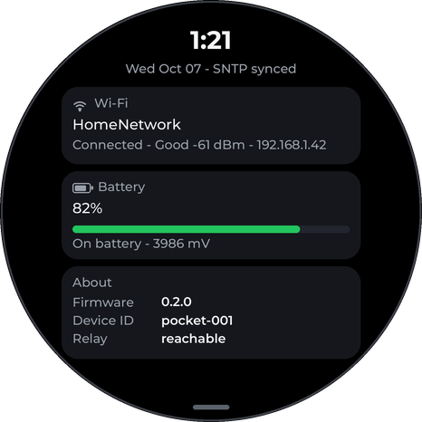
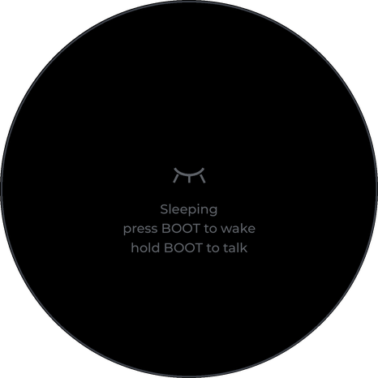

# Grok Bot Companion

ESP-IDF thin-client firmware for Frank Wagner's **Grok Bot Companion**, a pocket device on the
**Waveshare ESP32-S3-Touch-AMOLED-1.75** that talks to all of his Grok Bots.

Repo: https://github.com/roguespark-04/grokbot-companion

## Status

| Item | State |
| --- | --- |
| Firmware | **Builds clean** (ESP-IDF v5.5.1, BSP `waveshare/esp32_s3_touch_amoled_1_75` 3.0.1, LVGL 9.4) |
| Board hardware | **Not arrived.** Codec, I2S, PMIC, and RTC paths are marked `HARDWARE TODO` |
| Multi-bot touch UI | **Done in code**: carousel, per-bot panel, voice picker, device panel, sleep/lock |
| Meridian wake contract | v1 **locked**; v1.1 adds `target_bot_id` / `voice_id` / `conversation_id`. See [WEBHOOK_CONTRACT.md](WEBHOOK_CONTRACT.md) |
| Audio relay | **Live** on the shared box (Tailscale, `:8787`). Adds `/bots`, `/voices`, `/status`. See [relay/](relay/) |
| Buttons | **BOOT** = hold-to-talk (and wake from lock); **PWR** = power on/off (AXP2101) |

## Mockups

Rendered from the same layout numbers as `main/ui/` by
[`docs/mockups/render_mockups.py`](docs/mockups/render_mockups.py). The avatars are procedural:
we can't pull the Grok Bot app's real art or animations.

| Home / carousel | Swipe up: bot panel | Voice picker | Swipe down: device | Sleep / lock |
| --- | --- | --- | --- | --- |
|  |  |  |  |  |

The carousel wraps around: [01b_carousel_wrap_sequence.png](docs/mockups/01b_carousel_wrap_sequence.png).
The rest of the bot panel when scrolled: [02b](docs/mockups/02b_bot_panel_scrolled.png).
Every bot in every animation state: [06_avatar_states_sheet.png](docs/mockups/06_avatar_states_sheet.png).

## Touch UI (`main/ui/`)

| Gesture | Where | Result |
| --- | --- | --- |
| Swipe ← / → | anywhere on home | Previous or next bot. **Infinite circle**: past the last bot comes the first (and vice versa), with no end stop or bounce. Slots follow your finger, then glide one step. Neighbors peek at the round edge |
| Swipe ↑ | starting at the **bottom edge** (lowest ~90 px) | Per-bot panel |
| Swipe ↓ | starting at the **top edge** (top ~90 px) | Device settings |
| Swipe ↓ / tap grabber | top of the bot panel or voice picker | Close |
| Swipe ↑ / tap grabber | bottom of the device panel | Close |

* **Home** shows the selected bot's procedural avatar, name, and a live status line (dot +
  text such as "Photon is working on it"), plus time, Wi-Fi, battery, and page dots.
* **Per-bot panel**: talk mode (**Press to talk** is the default, or **Always listen**),
  Start/End conversation, **Voice**, volume, brightness (applies live), and auto-sleep
  (15s / 30s / 1m / 5m / Never).
* **Voice picker**: a roller of voices from `GET /voices`, a description, Preview (stub), and
  Select. The choice is stored per bot in NVS (`voice_<bot_id>`). With no saved choice it
  falls back to the bot's `default_voice_id`. The device only passes `voice_id`; Meridian/TTS
  decides what it sounds like. The seed voices are **placeholders**.
* **Device panel**: Wi-Fi (SSID, signal, status, IP), battery (%, charging, mV from the
  AXP2101), time (PCF85063 → SNTP), firmware version, device ID, and relay reachability.
* **Horizontal swipes inside panels never change the bot.** Panels sit on `lv_layer_top()`
  over the home screen, their content scrolls only vertically, and the home gesture handler
  also checks `g_ui.panel`. The carousel is also locked during a voice turn, so the reply
  stays with the bot you asked.
* **Persistence (NVS `companion`)**: `last_bot` (written after the carousel settles and at
  the start of every turn), `talk_mode`, `volume`, `bright`, `sleep_s`, `voice_<bot_id>`, plus
  cached `/bots` and `/voices` bodies so the carousel works offline. Boot and wake go back to
  the last bot.
* **Avatars** (`ui_avatar.c`) are data-driven. Each bot's shape, color, and accent come from
  `relay/bots.json`. States: idle = breathing + blink, listening = ripple rings, thinking =
  orbiting dots, working = fast accent orbit, speaking = amplitude-driven scale + mouth,
  error = shake + red. The renderer is a vtable (`ui_avatar_renderer_t`), so a sprite-sheet
  renderer can replace it per bot later.

### Bots (from the relay, `GET /bots`)

Meridian (blue circle) · Spark (amber star) · Quark (violet hexagon) · Scribe (teal squircle) ·
Photon (yellow diamond) · dr eggbot (cream egg) · Pulse (red ring) · Proton (green octagon) ·
Clay (burnt-orange pill) · Nexus (pink triangle). To change them, edit `relay/bots.json`; no
reflash is needed.

## Talking

| Mode | How a turn starts | Ends |
| --- | --- | --- |
| **Press to talk** (default) | Hold BOOT (≥ `MUSE_PTT_HOLD_MS`) | Release BOOT |
| **Always listen** | While a conversation is open, the energy VAD (`vad.c`) detects speech. ~300 ms of pre-roll is kept | ~800 ms of silence, or the max length |

BOOT works as PTT in both modes. Each turn: LISTENING → UPLOADING → THINKING/WORKING (the
status line follows the relay's `GET /status`) → SPEAKING → IDLE. The upload carries
`target_bot_id`, `voice_id`, and `conversation_id`. Meridian routes the turn to the chosen bot.

## Sleep & lock (`power_mgr.c`)

```
AWAKE --idle >= auto-sleep--> DIMMED (4 s, "Sleeping" hint) --> LOCKED
  ^                              |                               |
  +---- touch / BOOT / busy -----+                               |
  +---- BOOT short press (< 300 ms): screen on, NO recording <---+
  +---- BOOT hold (>= 300 ms): wake + LISTENING immediately <----+
```

* **Idle** means two things. First, nothing is active: no turn uploading, thinking, or
  speaking, no always-listen conversation open, and the current bot's status isn't thinking
  or working (stale statuses expire after 10 min). Second, no touch or button input for the
  auto-sleep timeout (default **30 s**; "Never" disables sleep).
* **Locked**: AMOLED brightness goes to 0 and the LVGL worker and tick are paused
  (`esp_lv_adapter_pause`). The touch indev is disabled, so touch is locked. The mic powers
  down and Wi-Fi switches to `WIFI_PS_MAX_MODEM` but stays associated, so status polls resume
  quickly. BOOT (GPIO0, low level) is the wake source, and the app task blocks so FreeRTOS
  tickless idle can enter **automatic light sleep** (`CONFIG_PM_ENABLE`).
* **Wake**: the mic is re-armed and recording starts before the screen comes back. A
  **short press** discards that audio and just shows the last bot. A **hold** past
  `MUSE_WAKE_LONG_PRESS_MS` (300 ms) becomes a voice turn with the first words kept.
  Releasing uploads as usual. The wake press never doubles as a PTT edge.
* **Awake**: BOOT is plain hold-to-talk, as before. **PWR** stays power on/off (PMIC).
* HARDWARE TODO for the one-charge-a-day goal: CO5300 sleep-in plus AMOLED rail gating,
  CST9217 sleep, then measuring real mA through the AXP2101.

## Hardware

- [Amazon (ASIN B0F7XTJ7JW)](https://www.amazon.com/Waveshare-ESP32-S3-Development-Dual-core-Microphones/dp/B0F7XTJ7JW) · [Product page](https://www.waveshare.com/esp32-s3-touch-amoled-1.75.htm) · [Wiki](https://www.waveshare.com/wiki/ESP32-S3-Touch-AMOLED-1.75) · [Waveshare GitHub](https://github.com/waveshareteam/ESP32-S3-Touch-AMOLED-1.75)

| Piece | Detail |
| --- | --- |
| MCU | ESP32-S3R8, 8 MB PSRAM, 16 MB flash |
| Display | 1.75″ AMOLED 466×466, CO5300 (QSPI), CST9217 touch (I2C) |
| Audio | ES7210 dual mic + AEC, ES8311 playback, 8 Ω 2 W speaker |
| Power / misc | AXP2101 PMIC (battery 1000 mAh planned), PCF85063 RTC, QMI8658 IMU, TCA9554 |
| Camera | Not in v1 |

Full GPIO map: [PINOUT.md](PINOUT.md).

## Build / flash

Requires **ESP-IDF ≥ 5.5** (the BSP v3 needs it). The component manager pulls the BSP, LVGL
9.4, the CO5300/CST9217 drivers, and esp_lvgl_adapter.

```bash
idf.py set-target esp32s3
idf.py menuconfig     # "Grok Bot Companion Configuration": Wi-Fi, relay URL, device token
idf.py build
idf.py -p /dev/ttyACM0 flash monitor
```

Key Kconfig: `MUSE_UPLOAD_URL`, `MUSE_DEVICE_RELAY_TOKEN`, `MUSE_DEVICE_ID`,
`MUSE_WAKE_LONG_PRESS_MS` (300), `MUSE_DIM_BEFORE_SLEEP_MS` (4000), `MUSE_PREROLL_MS` (300),
`MUSE_MAX_UTTERANCE_S` (20), `MUSE_TZ` (Chicago), and `MUSE_CAPTURE_STUB_SILENCE` (exercise the
relay path before the mic is wired). Custom `partitions.csv` uses a 6 MB factory app.

**Secrets**: Wi-Fi and the device↔relay token go in `sdkconfig`/NVS. Never commit them. The
Meridian sender key lives only in `relay/.env`.

Download mode: hold **BOOT**, tap **RESET**, release RESET, then release BOOT.

## Tree

```
main/
  main.c              app state machine: events, turns, always-listen VAD, sys task
  power_mgr.c         idle → dim → lock (light sleep) → BOOT short/long wake
  settings_store.c    NVS settings + per-bot voice + roster cache
  bot_registry.c      /bots + /voices JSON → structs (built-in fallback)
  webhook_client.c    relay HTTP: upload (routing headers), result poll, status, JSON GET
  audio_capture.c     pre-roll ring + turn buffer + WAV export (ES7210 read = TODO)
  audio_playback.c    reply download + level meter (ES8311 write = TODO)
  vad.c               energy VAD (always-listen)
  power_info.c        AXP2101 battery / charging
  rtc_time.c          PCF85063 + SNTP
  wifi_net.c          STA + reconnect + RSSI + power save
  ptt_button.c        BOOT debounce, edges, light-sleep wake ISR
  ui/                 LVGL 9 UI: ui.c, ui_home.c (carousel), ui_bot_panel.c,
                      ui_voice_picker.c, ui_device_panel.c, ui_gesture.c, ui_avatar.c
relay/                Flask relay on the shared box (bots.json, voices.json)
docs/mockups/         PNG mockups + renderer
```

## Open questions

- **Network path**: the relay is on the tailnet (100.x / `*.ts.net`), but the ESP32 can't run
  Tailscale. Options are Tailscale Funnel (public HTTPS plus the device token) or a LAN-side
  gateway. This needs deciding before first flash.
- Talk mode is device-wide today, while voice is per bot. Should talk mode be per bot too?
- Always-listen only listens while a conversation is open. Should selecting it start one?
- Real voice list for the TTS side, and whether Preview should play a relay-hosted clip.
- Unicode in status text needs a bigger font (Latin-1/emoji) built into flash.
